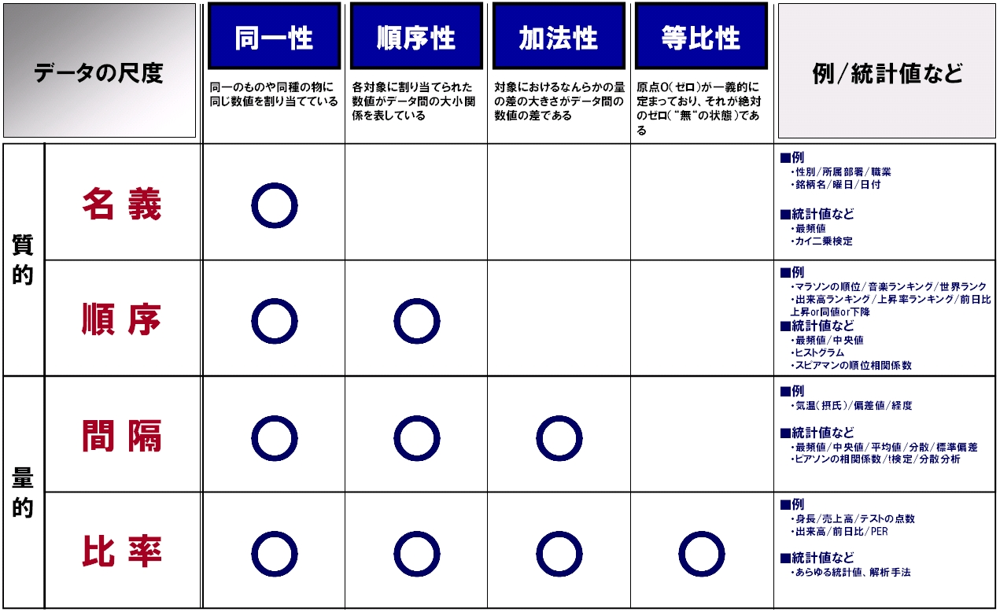

# 第1回　データ分析基礎

## 1. データとは？

### 1.0. まずはWikipedia

「データ（英: data）とは、事実や資料をさす言葉。伝達、解釈、処理などに適するように形式化、符号化されたもの、または再度**情報**として解釈できるもの。」

→いやいや、データと情報って同じものじゃないの？？

### 1.1. データ・情報・知識・知慧

データにまつわる概念に「DIKWピラミッド」という階層構造がある。

fig 1.DIKWピラミッド

**データ Data**：単体では意味を持たない事実の羅列。

　　　「Aさんの視力は0.2」「Bさんの視力は0.8」

**情報 Information**：データを整理して得られる、意味のある内容。

　　　「C病院の患者視力の平均は0.7」

**知識 Knowledge**：まとめた情報を洞察して得られる、一連の内容のつながり。

　　　「D地域では日本人の平均と比較して視力が低い理由はEである」

**知慧 Wisdom**：知識を統合して未来の意思決定に適用できるエッセンス。

　　　「理由Eを極力減らすために対策Fを行う」

上記のように、**「今扱っているのはどの階層なのか？」**を常に忘れないことが重要。

そして各ステップ間には「データの整理」「情報の洞察」「知識の統合」と**人の主観が必ず介在する**ため、扱う人によって無限の活用が存在する。

### 1.2. いま流行りの「ビッグデータ」でいい感じに何とかしてください

→まず無理。

1.1.で述べたように、データを扱うとは目的に向けてまとめていく行いなので、闇雲に弄りまわして何か掘り出し物が出てくることはないし、無理やりひねり出したものはおそらく正しくないことが多い。

「いい感じに何とか」の部分を「何のために」「何を」「どう集め」「どう処理し」「どうまとめ」「どう示す」とそれぞれ言語化できるようになることが、**「データを扱える」**ということに他ならない。

## 2. データの基本

### 2.0. 対象

データと一口に言っても数値や文字（テーブルデータ）、画像、音、波形、etc... と多種多様。

それぞれに固有の特徴があるが、今回はひとまず**テーブルデータ**を扱う。

### 2.1 値の種類

データの値（変数）には様々な種類があるが（男、女、Grade1、2...、1.0、1,234,567、...）、大きく以下の分類に分かれる。

#### 質的変数

- 分類尺度：男女、病院名、IDなど識別のために用いる、優劣や大小比較に意味のない尺度。カテゴリとも。
- 順序尺度：Gradeや優/良/可、かんたん/ふつう/むずかしい/おになど、大小比較は可能だが和差に意味のない尺度。

#### 量的変数

- 間隔尺度：気温（℃）、偏差値、経度、IQなど、和差に意味はあるが比に意味のない尺度。
- 比例尺度：身長、売上高、試験の点数など、比率・原点に意味のある尺度。

table 1. 変数の尺度　(出典：http://highfai.com/systemtrade/article0107.html)

