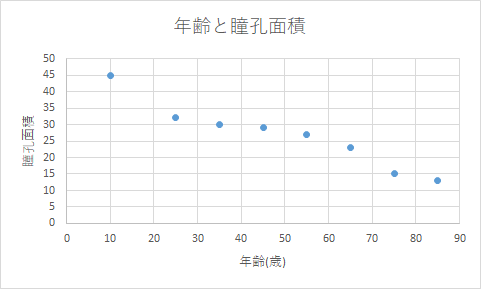

# 第02回課題

## 問1

次の表は当院で測定された、年代および年代ごとの平均瞳孔面積との関係である。以下の問に答えよ。

ただし、年代には幅があるためその中間の値を代表値として計算すること。（20-30なら25歳として扱う）

適宜電卓などを用いても良いが、ExcelやPython等の関数で直接値を計算することは禁止。

| 年代(歳) | 平均瞳孔面積(mm2) |
| -------- | ----------------- |
| 0-20     | 45                |
| 20-30    | 32                |
| 30-40    | 30                |
| 40-50    | 29                |
| 50-60    | 27                |
| 60-70    | 23                |
| 70-80    | 15                |
| 80-90    | 13                |

（１）上の表に関して、横軸を年齢、縦軸を瞳孔面積として散布図を書け。

（２）年齢の平均・分散・標準偏差を求めよ。

（３）瞳孔面積の平均・分散・標準偏差を求めよ。

（４）年齢と瞳孔面積の共分散を求めよ。

（５）年齢と瞳孔面積の相関係数を求めよ。

| 年代         | 年齢（代表値） | 瞳孔面積       |      | 年齢の偏差 | 面積の偏差   | 偏差同士の積          |
| ------------ | -------------- | -------------- | ---- | ---------- | ------------ | --------------------- |
| 0-20         | 10             | 45             |      | -39.375    | 18.25        | -718.59375            |
| 20-30        | 25             | 32             |      | -24.375    | 5.25         | -127.96875            |
| 30-40        | 35             | 30             |      | -14.375    | 3.25         | -46.71875             |
| 40-50        | 45             | 29             |      | -4.375     | 2.25         | -9.84375              |
| 50-60        | 55             | 27             |      | 5.625      | 0.25         | 1.40625               |
| 60-70        | 65             | 23             |      | 15.625     | -3.75        | -58.59375             |
| 70-80        | 75             | 15             |      | 25.625     | -11.75       | -301.09375            |
| 80-90        | 85             | 13             |      | 35.625     | -13.75       | -489.84375            |
|              |                |                |      |            |              | ↓平均をとる           |
| **平均**     | 49.375         | 26.75          |      |            | **共分散**   | -218.90625            |
| **分散**     | 571.4844       | 89.6875        |      |            |              | ↓標準偏差sx, syで割る |
| **標準偏差** | 23.90574 (=sx) | 9.470348 (=sy) |      |            | **相関係数** | -0.9669188            |

（６）以下の選択肢の中で確実に正しいものを全て選べ。

　　×ア. 年齢の高低と瞳孔面積の大小に明らかな関係は認められない。

　　○イ. 年齢と瞳孔面積との間には非常に強い負の相関がある。

　　　　相関係数が-0.9を下回っており、非常に強い負の相関があると言ってよい。

　　×ウ. 加齢が原因で瞳孔面積が縮小する。

　　　　年齢の増加と瞳孔面積の縮小に相関関係はあるが、因果関係は明らかでない。

　　×エ. 瞳孔面積の中央値は瞳孔面積の平均値より小さい。
$$
\frac{29+27}{2}=28>26.75
$$
　　○オ. 瞳孔面積が40mm2のとき、偏差値は約64である。
$$
\frac{40-26.75}{9.47}×10+50\fallingdotseq64
$$
（７）測定機器に故障があり、実はすべての瞳孔面積のデータが10％小さく測定されていたことがわかった。このとき、年齢と正しい瞳孔面積との相関係数はいくつか。

　　実際の面積は上のデータの10/9倍となる。このとき面積の標準偏差は10/9倍、共分散も10/9倍となるので、**相関係数は変化せず-0.9669...のまま**となる。

## 問2

以下の問題ではジョーカーの無い52枚のトランプを扱うこととし、カードを引く際はどのカードも同様に確からしいとする。

（１）トランプからカードを1枚引くとき、そのカードがスペードである確率を求めよ。
$$
\frac{1}{4}
$$
（２）トランプからカードを1枚引くとき、そのカードがスペードかエースである確率を求めよ。
$$
\frac{13+4-1}{52}=\frac{16}{52}=\frac{4}{13}
$$
（３）トランプからカードを1枚引くとき、そのカードが10より大きい確率を求めよ。
$$
\frac{3}{13}
$$
（４）トランプからカードを3枚引き、その順番に横一列に並べるとき、並べ方は全部で何通りあるか。
$$
52×51×50=132600
$$
（５）トランプからカードを3枚引いて手札にするとき、その組み合わせは全部で何通りあるか。
$$
{}_{52}C_3=\frac{52×51×50}{3×2×1}=22100
$$
（６）トランプからカードを3枚引いて手札にするとき、3枚ともスペードである確率を求めよ。（発展問題）

　　解答1　1枚目がスペード→2枚目もスペード→3枚目もスペード　と考えてそれぞれ確率を掛ける
$$
\frac{13}{52}×\frac{12}{51}×\frac{11}{50}=\frac{11}{850}
$$
　　解答2　「全部のカードから3枚引く組」うち「スペードのみから3枚引く組」の割合と考える
$$
\frac{_{13}C_3}{_{52}C_3}=\frac{\frac{13×12×11}{3×2×1}}{\frac{52×51×50}{3×2×1}}=\frac{13×12×11}{52×51×50}=\frac{11}{850}
$$