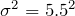

# 第04回課題

## 問1

次のグラフは標準正規分布であり、水色の部分の面積は確率変数Zがz以上である確率である。

この確率がα％のとき、zのことを**上側α％点**と呼ぶ。

以下の設問において、標準正規分布の
上側10%点は1.28、上側5%点は1.64、上側2.5%点は1.96、上側0.5%点は2.58
であることを用いても良い。

日本人男性 n 人をランダムに選んで身長を測定したところ、平均値は 172 cmであった。ただし、日本人男性の身長の母分散はであるとし、日本人男性の身長は正規分布に従うものとする。

（1）n = 100のとき、日本人男性の身長の母平均 μ の **90** ％信頼区間を求めよ。 

（2）n = 100のとき、日本人男性の身長の母平均 μ の **95** ％信頼区間を求めよ。 

（3）n = 100のとき、日本人男性の身長の母平均 μ の **99** ％信頼区間を求めよ。 

（4）n = **1000**のとき、日本人男性の身長の母平均 μ の 95 ％信頼区間を求めよ。 

（5）n = **10000**のとき、日本人男性の身長の母平均 μ の 95 ％信頼区間を求めよ。 

## 問2

区間推定について述べられた文章のうち、正しいものを全て選べ。

1. 信頼係数（信頼区間の前につく90%, 95%, 99%などの数字）は自由に設定してよい
2. 標本から推定された母平均の95%信頼区間の中には、95％の確率で母平均が含まれている
3. 信頼係数が大きいほど、信頼区間の幅は狭くなる
4. サンプルサイズが大きいほど、信頼区間の幅は狭くなる

