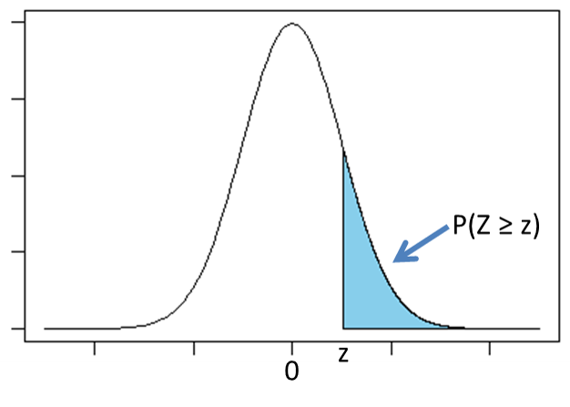

# 第04回課題

## 問1

次のグラフは標準正規分布であり、水色の部分の面積は確率変数Zがz以上である確率である。

この確率がα％のとき、zのことを**上側α％点**と呼ぶ。

以下の設問において、標準正規分布の
上側10%点は1.28、上側5%点は1.64、上側2.5%点は1.96、上側0.5%点は2.58
であることを用いても良い。

日本人男性 n 人をランダムに選んで身長を測定したところ、平均値は 172 cmであった。ただし、日本人男性の身長の母分散は $\sigma^2={5.5}^2$ であるとし、日本人男性の身長は正規分布に従うものとする。

（1）n = 100のとき、日本人男性の身長の母平均 $μ$ の **90** ％信頼区間を求めよ。 

中心極限定理から、身長の平均は「平均 $μ$ 、標準偏差 $\Large\frac{5.5}{\sqrt{n}}$ 」の正規分布に従う。

90%信頼区間を考えるとき、両端の面積はそれぞれ $\large\frac{100-90}{2}\normalsize=5\%$なので、上側5％点（1.64）を用いる。

従って、
$$
μ-1.64×\frac{5.5}{\sqrt{100}}\le172\leμ+1.64×\frac{5.5}{\sqrt{100}}\\
172-1.64×\frac{5.5}{\sqrt{100}}\leμ\le172+1.64×\frac{5.5}{\sqrt{100}}\\
171.098\leμ\le172.902
$$
（2）n = 100のとき、日本人男性の身長の母平均 $μ$ の **95** ％信頼区間を求めよ。 

95%信頼区間を考えるとき、両端の面積はそれぞれ $\large\frac{100-95}{2}\normalsize=2.5\%$なので、上側2.5％点（1.96）を用いる。
$$
μ-1.96×\frac{5.5}{\sqrt{100}}\le172\leμ+1.96×\frac{5.5}{\sqrt{100}}\\
172-1.96×\frac{5.5}{\sqrt{100}}\leμ\le172+1.96×\frac{5.5}{\sqrt{100}}\\
170.922\leμ\le173.078
$$
（3）n = 100のとき、日本人男性の身長の母平均 $μ$ の **99** ％信頼区間を求めよ。 

99%信頼区間を考えるとき、両端の面積はそれぞれ $\large\frac{100-99}{2}\normalsize=0.5\%$なので、上側0.5％点（2.58）を用いる。
$$
μ-2.58×\frac{5.5}{\sqrt{100}}\le172\leμ+2.58×\frac{5.5}{\sqrt{100}}\\
172-2.58×\frac{5.5}{\sqrt{100}}\leμ\le172+2.58×\frac{5.5}{\sqrt{100}}\\
170.581\leμ\le173.419
$$
（4）n = **1000**のとき、日本人男性の身長の母平均 $μ$ の 95 ％信頼区間を求めよ。 
$$
μ-1.96×\frac{5.5}{\sqrt{1000}}\le172\leμ+1.96×\frac{5.5}{\sqrt{1000}}\\
172-1.96×\frac{5.5}{\sqrt{1000}}\leμ\le172+1.96×\frac{5.5}{\sqrt{1000}}\\
171.659\leμ\le172.341
$$
（5）n = **10000**のとき、日本人男性の身長の母平均 $μ$ の 95 ％信頼区間を求めよ。 
$$
μ-1.96×\frac{5.5}{\sqrt{10000}}\le172\leμ+1.96×\frac{5.5}{\sqrt{10000}}\\
172-1.96×\frac{5.5}{\sqrt{10000}}\leμ\le172+1.96×\frac{5.5}{\sqrt{10000}}\\
171.8922\leμ\le172.1078
$$

## 問2

区間推定について述べられた文章のうち、正しいものを全て選べ。

1. 信頼係数（信頼区間の前につく90%, 95%, 99%などの数字）は自由に設定してよい
   正しい。
2. 標本から推定された母平均の95%信頼区間の中には、95％の確率で母平均が含まれている
   正しくない。
   95％信頼区間とは、「n人の標本をとってきて真の値（問1の例ではμ）の区間を推定する作業を100回行ったとき、95回くらいはその区間の中に真の値が含まれている」という意味。
   算出された1回の区間の中に真の値が含まれる確率とは異なる。
3. 信頼係数が大きいほど、信頼区間の幅は狭くなる
   正しくない。問1参照。
4. サンプルサイズが大きいほど、信頼区間の幅は狭くなる
   正しい。問1参照。

